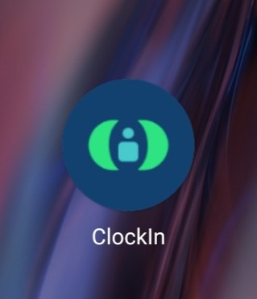

# 📱 ClockIn Mobile App - User Manual

> **Panduan Lengkap Penggunaan Aplikasi Mobile ClockIn**  
> Dari install sampai absen setiap hari dengan mudah!

---

## 📖 Daftar Isi
1. [Instalasi Aplikasi](#1-instalasi-aplikasi)
2. [Splash Screen](#2-splash-screen)
3. [Onboarding](#3-onboarding)
4. [Login](#4-login)
5. [Home Screen / Dashboard](#5-home-screen--dashboard)
6. [Check In](#6-check-in)
7. [Check Out](#7-check-out)
8. [Riwayat Kehadiran](#8-riwayat-kehadiran)
9. [Profile](#9-profile)
10. [Izin & Cuti](#10-izin--cuti)
11. [Notifikasi](#11-notifikasi)
12. [Logout](#12-logout)

---

## 1. Instalasi Aplikasi

### 📸 Screenshot

> **Simpan screenshot dengan nama file:**
> - `01-app-icon.png`
> - `02-splash-screen.png` (untuk section berikutnya)

### 📝 Deskripsi
**Halaman ini adalah langkah pertama kamu untuk menggunakan ClockIn**

**Fungsi:**
- Download dan install aplikasi ClockIn di smartphone kamu
- Pastikan aplikasi berhasil terinstall dan muncul icon di home screen

**Cara Pakai:**
1. Buka **Google Play Store** (Android) atau **App Store** (iOS)
2. Cari aplikasi dengan keyword **"ClockIn"**
3. Tekan tombol **Install** / **Download**
4. Tunggu sampai proses download dan instalasi selesai
5. Icon aplikasi ClockIn akan muncul di home screen kamu
6. Tap icon untuk membuka aplikasi

**Tips:**
- Pastikan koneksi internet kamu stabil
- Cek storage HP kamu cukup untuk install aplikasi
- Berikan izin akses yang diminta aplikasi (lokasi, kamera, dll)

---

## 2. Splash Screen

### 📸 Screenshot

> **Simpan screenshot dengan nama file:** `02-splash-screen.png`

### 📝 Deskripsi
**Ini adalah tampilan pertama saat kamu membuka aplikasi**

**Fungsi:**
- Loading awal aplikasi
- Menampilkan branding ClockIn
- Menyiapkan sistem aplikasi sebelum masuk ke halaman utama

**Apa yang Terjadi:**
- Aplikasi sedang memuat data dan konfigurasi
- Cek koneksi ke server
- Otomatis pindah ke halaman berikutnya dalam 2-3 detik

**Catatan:**
Kamu tidak perlu melakukan apa-apa di halaman ini, tunggu saja sampai loading selesai.

---

## 3. Onboarding

### 📸 Screenshot

> **Simpan screenshot dengan nama file:**
> - `03-onboarding-1.png`, `04-onboarding-2.png`, `05-onboarding-3.png`

### 📝 Deskripsi
**Halaman pengenalan fitur-fitur utama ClockIn untuk user baru**

**Fungsi:**
- Memberikan gambaran fitur-fitur yang tersedia
- Membantu kamu memahami cara kerja aplikasi
- Onboarding hanya muncul sekali saat pertama kali install

**Cara Pakai:**
1. Swipe ke kiri untuk lanjut ke slide berikutnya
2. Baca penjelasan di setiap slide
3. Di slide terakhir, tekan tombol **"Mulai"** atau **"Get Started"**
4. Kamu akan diarahkan ke halaman Login

**Tips:**
- Kamu bisa skip onboarding dengan tekan tombol "Skip" di pojok kanan atas
- Onboarding tidak akan muncul lagi setelah kamu login pertama kali

---

## 4. Login

### 📸 Screenshot

> **Simpan screenshot dengan nama file:**
> - `06-login-page.png`, `07-login-loading.png`, `08-login-error.png`

### 📝 Deskripsi
**Halaman untuk masuk ke akun kamu dan mulai menggunakan ClockIn**

**Fungsi:**
- Autentikasi user dengan email dan password
- Validasi akses ke sistem absensi perusahaan
- Menyimpan session login agar tidak perlu login berulang kali

**Cara Pakai:**
1. Masukkan **Email** yang sudah terdaftar di sistem
2. Masukkan **Password** akun kamu
3. Tekan tombol **"Login"**
4. Tunggu proses autentikasi
5. Jika berhasil, kamu akan masuk ke Home Screen

**Troubleshooting:**
- **Email/Password salah?** → Periksa kembali atau hubungi admin untuk reset password
- **Tidak bisa login?** → Pastikan koneksi internet aktif
- **Akun belum terdaftar?** → Hubungi HRD atau admin untuk registrasi akun

**Tips:**
- Aktifkan "Remember Me" agar tidak perlu login setiap kali buka aplikasi
- Jangan share password kamu ke orang lain
- Gunakan password yang kuat (minimal 8 karakter, kombinasi huruf & angka)

---

## 5. Home Screen / Dashboard

### 📸 Screenshot

> **Simpan screenshot dengan nama file:**
> - `09-home-morning.png`, `10-home-status-belum-checkin.png`, `11-home-summary.png`

### 📝 Deskripsi
**Halaman utama aplikasi, pusat semua aktivitas absensi kamu**

**Fungsi:**
- Menampilkan status kehadiran hari ini
- Quick access untuk Check In dan Check Out
- Melihat ringkasan absensi bulan berjalan
- Akses cepat ke menu-menu penting

**Apa yang Ditampilkan:**
- **Header:** Greeting dengan nama kamu (Selamat Pagi, [Nama])
- **Status Card:** Apakah kamu sudah Check In/Out hari ini
- **Tombol Check In/Out:** Untuk absen masuk/keluar
- **Summary:** Total kehadiran, izin, terlambat, dan alfa bulan ini
- **Bottom Navigation:** Menu navigasi ke halaman lain

**Cara Pakai:**
- Untuk **Check In**, tekan tombol hijau "Check In"
- Untuk **Check Out**, tekan tombol merah "Check Out"
- Lihat detail absensi dengan tap pada card summary
- Gunakan bottom navigation untuk pindah ke menu lain

**Tips:**
- Home screen akan refresh otomatis saat dibuka
- Pull down untuk refresh manual
- Status waktu Check In/Out akan ditampilkan real-time

---

## 6. Check In

### 📸 Screenshot

> **Simpan screenshot dengan nama file:**
> - `12-checkin-popup.png`, `13-checkin-location.png`, `14-checkin-camera.png`, `15-checkin-success.png`

### 📝 Deskripsi
**Fitur untuk absen masuk setiap hari saat datang ke kantor**

**Fungsi:**
- Mencatat waktu kedatangan kamu
- Menyimpan lokasi saat Check In (untuk validasi)
- Mengambil foto selfie sebagai bukti kehadiran
- Menghitung apakah kamu tepat waktu atau terlambat

**Cara Pakai:**
1. Dari Home Screen, tekan tombol **"Check In"**
2. Aplikasi akan minta izin akses **Lokasi** → Izinkan
3. Pastikan kamu berada di **area kantor** (dalam radius yang ditentukan)
4. Aplikasi akan membuka **kamera** → Izinkan akses kamera
5. Ambil **foto selfie** dengan jelas
6. Tekan tombol **"Confirm Check In"**
7. Tunggu proses upload data
8. Akan muncul notifikasi **"Check In Berhasil"** dengan timestamp

**Apa yang Dicatat:**
- ✅ Waktu Check In (jam, menit, detik)
- 📍 Lokasi GPS (latitude, longitude)
- 📷 Foto selfie
- 🏢 Status: Tepat Waktu / Terlambat

**Troubleshooting:**
- **Lokasi tidak terdeteksi?** → Pastikan GPS aktif dan izin lokasi diberikan
- **Kamera tidak bisa dibuka?** → Cek permission kamera di settings HP
- **Check In gagal?** → Pastikan berada di area kantor dan koneksi internet stabil
- **Diluar area kantor?** → Hubungi admin jika kamu sedang WFH atau di lokasi lain

**Tips:**
- Check In paling lambat jam 08:00 (sesuai kebijakan perusahaan)
- Pastikan wajah terlihat jelas di foto selfie
- Jangan pakai filter atau edit foto
- Jika terlambat, akan otomatis tercatat dan bisa dikurangi dari penilaian

---

## 7. Check Out

### 📸 Screenshot

> **Simpan screenshot dengan nama file:**
> - `16-checkout-popup.png`, `17-checkout-camera.png`, `18-checkout-success.png`

### 📝 Deskripsi
**Fitur untuk absen pulang setiap hari saat meninggalkan kantor**

**Fungsi:**
- Mencatat waktu pulang kamu
- Menghitung durasi kerja hari ini (dari Check In sampai Check Out)
- Menyimpan lokasi saat Check Out
- Mengambil foto selfie sebagai bukti Check Out

**Cara Pakai:**
1. Dari Home Screen, tekan tombol **"Check Out"**
2. Aplikasi akan minta izin akses **Lokasi** → Izinkan
3. Pastikan kamu masih di **area kantor**
4. Aplikasi akan membuka **kamera** → Ambil foto selfie
5. Tekan tombol **"Confirm Check Out"**
6. Tunggu proses upload data
7. Akan muncul notifikasi **"Check Out Berhasil"** dengan total jam kerja

**Apa yang Dicatat:**
- ✅ Waktu Check Out (jam, menit, detik)
- 📍 Lokasi GPS
- 📷 Foto selfie
- ⏱️ Total durasi kerja hari ini

**Catatan Penting:**
- Check Out paling cepat jam 17:00 (sesuai kebijakan perusahaan)
- Jika Check Out lebih awal, akan tercatat dan bisa mempengaruhi penilaian
- Pastikan sudah Check In sebelum bisa Check Out
- Tidak bisa Check Out 2 kali dalam sehari

**Tips:**
- Jangan lupa Check Out sebelum pulang
- Jika lupa Check Out, hubungi HRD untuk koreksi manual
- Durasi kerja akan dihitung otomatis dan masuk ke report

---

## 8. Riwayat Kehadiran

### 📸 Screenshot

> **Simpan screenshot dengan nama file:**
> - `19-history-list.png`, `20-history-detail.png`, `21-history-filter.png`

### 📝 Deskripsi
**Halaman untuk melihat history absensi kamu dari waktu ke waktu**

**Fungsi:**
- Melihat rekap kehadiran harian, mingguan, atau bulanan
- Cek detail waktu Check In dan Check Out setiap hari
- Filter berdasarkan tanggal atau bulan tertentu
- Melihat status kehadiran (Hadir, Izin, Sakit, Alfa, Terlambat)

**Cara Pakai:**
1. Dari Home Screen, tap menu **"Riwayat"** atau **"History"** di bottom navigation
2. Akan muncul list kehadiran dari yang terbaru
3. Scroll untuk lihat riwayat lebih lama
4. Tap pada salah satu item untuk lihat **detail** kehadiran hari itu
5. Gunakan **filter** untuk cari tanggal atau bulan tertentu

**Informasi yang Ditampilkan:**
- 📅 Tanggal kehadiran
- ⏰ Waktu Check In dan Check Out
- 📍 Lokasi Check In/Out
- 📷 Foto selfie
- ⏱️ Total jam kerja
- 🏷️ Status: Hadir / Terlambat / Izin / Sakit / Alfa

**Tips:**
- Gunakan filter untuk export report bulanan
- Cek riwayat untuk pastikan tidak ada data yang terlewat
- Jika ada kesalahan data, segera hubungi HRD

---

## 9. Profile

### 📸 Screenshot

> **Simpan screenshot dengan nama file:**
> - `22-profile-page.png`, `23-profile-edit.png`, `24-change-password.png`

### 📝 Deskripsi
**Halaman untuk melihat dan mengedit informasi akun kamu**

**Fungsi:**
- Melihat data pribadi (nama, email, jabatan, divisi)
- Edit foto profile
- Ubah password
- Pengaturan notifikasi
- Informasi perusahaan

**Cara Pakai:**
1. Dari bottom navigation, tap icon **"Profile"**
2. Untuk **edit profile**, tap tombol "Edit" di pojok kanan atas
3. Ubah data yang ingin diubah (foto, nama, dll)
4. Tap **"Save"** untuk menyimpan perubahan
5. Untuk **ubah password**, tap menu "Ubah Password"
6. Masukkan password lama dan password baru
7. Tap **"Update Password"**

**Data yang Ditampilkan:**
- 👤 Nama lengkap
- 📧 Email
- 📱 No. HP
- 🏢 Divisi / Departemen
- 💼 Jabatan
- 📅 Tanggal bergabung
- 🆔 Employee ID

**Tips:**
- Pastikan foto profile terlihat profesional
- Jangan gunakan password yang mudah ditebak
- Update nomor HP jika ada perubahan untuk keperluan emergency

---

## 10. Izin & Cuti

### 📸 Screenshot

> **Simpan screenshot dengan nama file:**
> - `25-leave-form.png`, `26-leave-type.png`, `27-leave-status.png`

### 📝 Deskripsi
**Fitur untuk mengajukan izin tidak masuk atau cuti**

**Fungsi:**
- Mengajukan izin sakit, cuti, atau keperluan mendadak
- Upload surat keterangan dokter atau dokumen pendukung
- Tracking status approval dari atasan
- Melihat sisa kuota cuti

**Cara Pakai:**
1. Dari Home atau Menu, tap **"Izin & Cuti"**
2. Tekan tombol **"+ Buat Pengajuan Baru"**
3. Pilih **jenis izin:**
   - **Sakit** (dengan surat dokter)
   - **Cuti** (liburan, keperluan pribadi)
   - **Izin** (keperluan mendadak)
4. Tentukan **tanggal mulai** dan **tanggal selesai**
5. Isi **alasan** dengan jelas
6. Upload **dokumen pendukung** (jika ada)
7. Tekan **"Kirim Pengajuan"**
8. Tunggu approval dari atasan

**Status Pengajuan:**
- 🟡 **Pending:** Menunggu persetujuan atasan
- 🟢 **Approved:** Disetujui, izin diterima
- 🔴 **Rejected:** Ditolak, perlu pengajuan ulang

**Tips:**
- Ajukan izin minimal H-1 untuk cuti terencana
- Untuk sakit mendadak, segera ajukan di hari yang sama
- Lengkapi dengan dokumen untuk mempercepat approval
- Cek sisa kuota cuti sebelum mengajukan

---

## 11. Logout

### 📸 Screenshot

> **Simpan screenshot dengan nama file:** `30-logout-confirmation.png`

### 📝 Deskripsi
**Fitur untuk keluar dari akun dan mengakhiri session**

**Fungsi:**
- Mengakhiri session login
- Menghapus data cache lokal
- Keamanan akun saat ganti device atau pinjam HP orang

**Cara Pakai:**
1. Buka halaman **Profile**
2. Scroll ke bawah, cari menu **"Logout"** atau **"Keluar"**
3. Tap tombol **"Logout"**
4. Akan muncul pop-up konfirmasi: **"Yakin ingin keluar?"**
5. Tap **"Ya"** untuk logout
6. Kamu akan diarahkan kembali ke **halaman Login**

**Kapan Perlu Logout:**
- Selesai menggunakan aplikasi di HP orang lain
- Mau ganti akun
- Keamanan jika HP hilang atau dicuri (logout dari device lain)

**Catatan:**
- Setelah logout, kamu harus login lagi dengan email & password
- Data absensi tetap tersimpan di server, tidak akan hilang
- Logout tidak akan membatalkan status Check In hari ini

**Tips:**
- Jangan logout jika masih di tengah proses Check In/Out
- Jika mau ganti HP, logout dulu dari HP lama sebelum login di HP baru
- Simpan password kamu agar tidak lupa saat login kembali

---

## 📞 Butuh Bantuan?

Jika kamu mengalami kendala atau butuh bantuan:
- 📧 Email: support@clockin.cloud
- 💬 WhatsApp: +62 xxx-xxxx-xxxx
- 🏢 Hubungi HRD kantor kamu

---

## ⚠️ Tips Penting

✅ **Dos:**
- Selalu Check In/Out setiap hari
- Pastikan foto selfie terlihat jelas
- Berada di area kantor saat absen
- Ajukan izin jika tidak bisa masuk
- Cek riwayat kehadiran secara berkala

❌ **Don'ts:**
- Jangan titip absen ke teman
- Jangan edit foto atau pakai foto orang lain
- Jangan Check In dari luar area kantor (kecuali WFH dan sudah approved)
- Jangan share password ke siapapun
- Jangan lupa Check Out saat pulang

---

**© 2025 ClockIn by Team Kelompok 4 Sehat 5 Sempurna**  
*Ngoding sehat, hasil sempurna... kadang-kadang.* 😄