# 💻 ClockIn Web Admin - User Manual

> **Panduan Lengkap Penggunaan Web Admin ClockIn+**  
> Untuk Admin, HRD, dan Management dalam mengelola sistem absensi karyawan

---

## 📖 Daftar Isi
1. [Akses Web Admin](#1-akses-web-admin)
2. [Login Admin](#2-login-admin)
3. [Dashboard Overview](#3-dashboard-overview)
4. [Manajemen Karyawan (Employees)](#4-manajemen-karyawan-employees)
5. [Data Kehadiran (Attendances)](#5-data-kehadiran-attendances)
6. [Pengajuan Izin & Cuti (Leave Requests)](#6-pengajuan-izin--cuti-leave-requests)
7. [Pengaturan Perusahaan (My Company)](#7-pengaturan-perusahaan-my-company)
8. [Logout](#8-logout)

---

## 1. Akses Web Admin

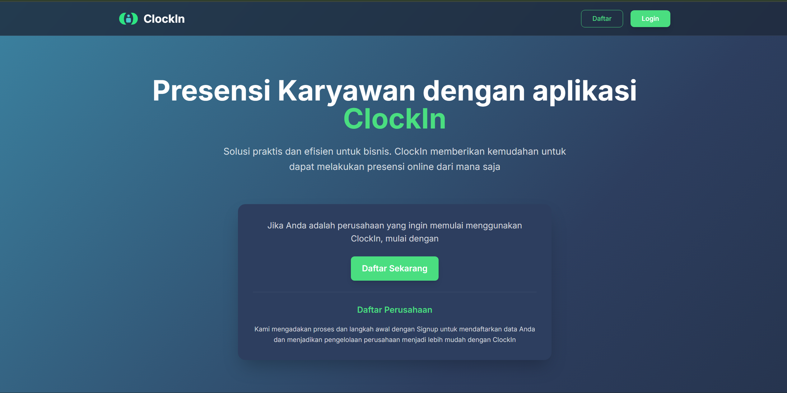
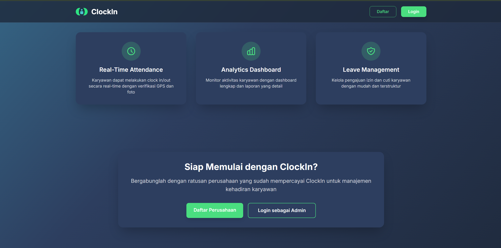
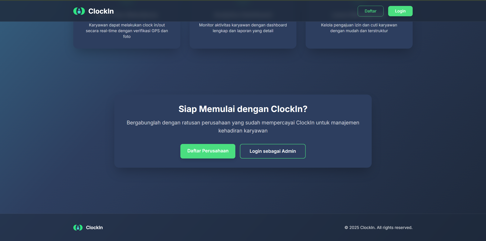

### 📝 Deskripsi
**Langkah pertama untuk mengakses sistem administrasi ClockIn+**

**Fungsi:**
- Membuka halaman web admin melalui browser
- Akses ke control panel untuk mengelola sistem absensi

**Cara Pakai:**
1. Buka browser (Chrome, Firefox, Edge, Safari)
2. Ketik URL: **https://clockin.cloud/admin**
3. Tekan Enter
4. Akan muncul halaman login admin

**Requirements:**
- ✅ Koneksi internet stabil
- ✅ Browser modern (Chrome v90+, Firefox v88+, Edge v90+)
- ✅ Akun admin yang sudah terdaftar
- ✅ Resolusi layar minimal 1366x768 (recommended: 1920x1080)

**Tips:**
- Bookmark URL untuk akses cepat
- Gunakan laptop/PC untuk pengalaman terbaik
- Pastikan tidak menggunakan mode incognito jika ingin save session

---

## 2. Login Admin

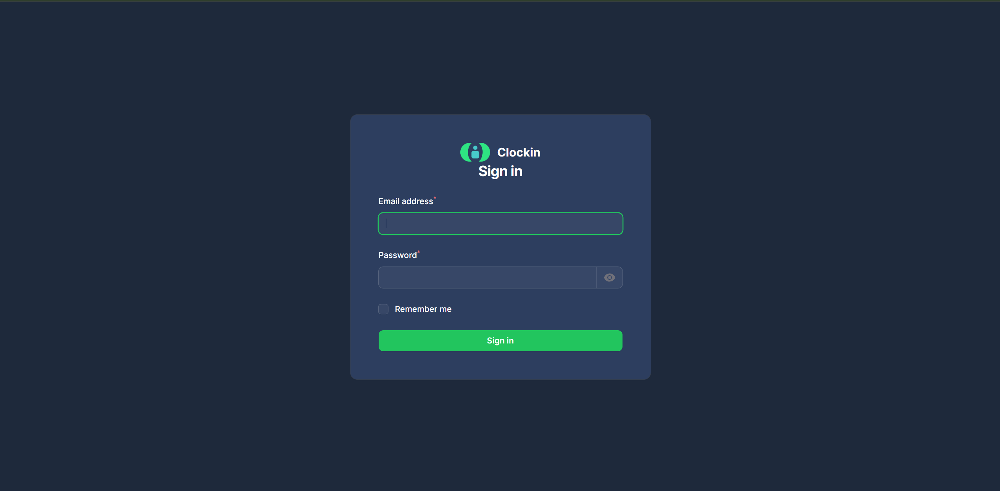

### 📝 Deskripsi
**Halaman autentikasi untuk masuk ke dashboard admin**

**Fungsi:**
- Verifikasi identitas admin
- Keamanan akses sistem dengan authentication
- Menyimpan session untuk tidak perlu login berulang

**Cara Pakai:**
1. Masukkan **Email Admin** yang sudah terdaftar
2. Masukkan **Password** akun admin
3. *(Opsional)* Centang **"Remember Me"** untuk auto-login
4. Tekan tombol **"Login"** atau **"Sign In"**
5. Jika menggunakan 2FA, masukkan **kode verifikasi** dari authenticator
6. Tunggu proses autentikasi
7. Jika berhasil, akan masuk ke **Dashboard Admin**

**Role & Permission:**
- 🔴 **Super Admin:** Full access ke semua fitur
- 🟠 **Admin HRD:** Manage karyawan, approval, laporan
- 🟡 **Manager:** View report dan monitoring tim
- 🟢 **Viewer:** Hanya bisa lihat data, tidak bisa edit

**Troubleshooting:**
- **Email/Password salah?** → Reset password via email
- **Akun terkunci?** → Hubungi Super Admin untuk unlock
- **Lupa password?** → Klik "Forgot Password" dan ikuti instruksi
- **2FA bermasalah?** → Gunakan backup code atau hubungi IT support

**Tips:**
- Gunakan password yang kuat dan unik
- Jangan share kredensial login
- Logout jika selesai menggunakan sistem
- Update password secara berkala

---

## 3. Dashboard Overview

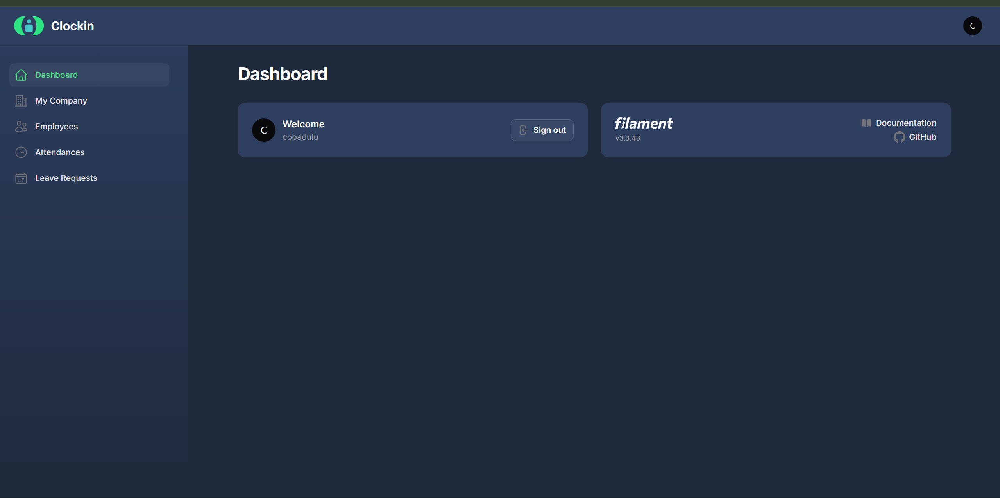

### 📝 Deskripsi
**Halaman utama admin yang menampilkan ringkasan sistem**

**Fungsi:**
- Melihat overview sistem ClockIn+
- Quick access ke menu-menu utama
- Widget informasi akun admin

**Apa yang Ditampilkan:**

### 📊 Dashboard Widgets:
- **Account Widget:** Informasi akun admin yang sedang login
- **Filament Info Widget:** Informasi versi dan dokumentasi Filament

### 📋 Navigasi Utama (Sidebar):
- 🏠 **Dashboard:** Halaman utama
- 🏢 **My Company:** Pengaturan data perusahaan
- 👥 **Employees:** Manajemen data karyawan  
- ⏰ **Attendances:** Data kehadiran karyawan
- 📝 **Leave Requests:** Pengajuan izin dan cuti

**Cara Pakai:**
- Gunakan menu sidebar untuk navigasi
- Dashboard sebagai halaman overview
- Klik menu untuk masuk ke fitur spesifik

**Tips:**
- Dashboard ini adalah entry point untuk semua fitur
- Bookmark halaman ini untuk akses cepat
- Gunakan dark mode untuk kenyamanan mata

---

## 4. Manajemen Karyawan (Employees)

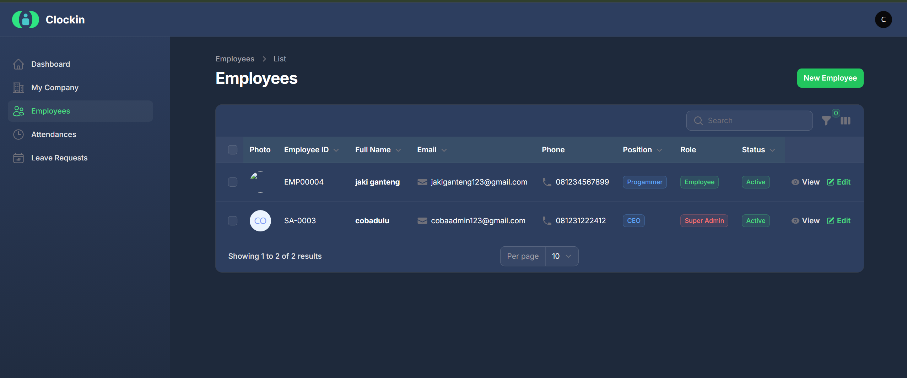
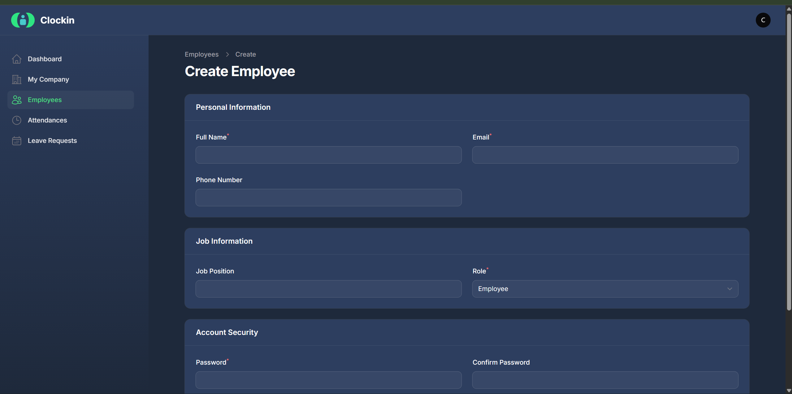
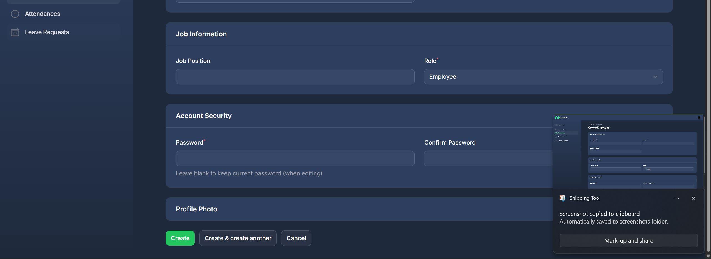

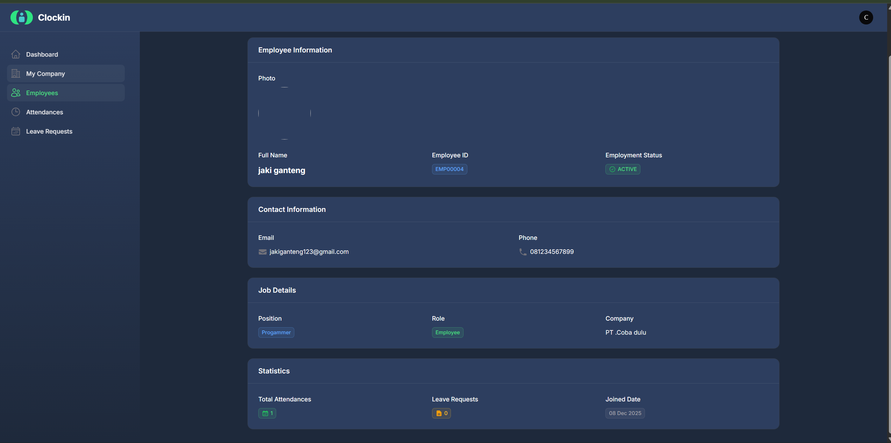
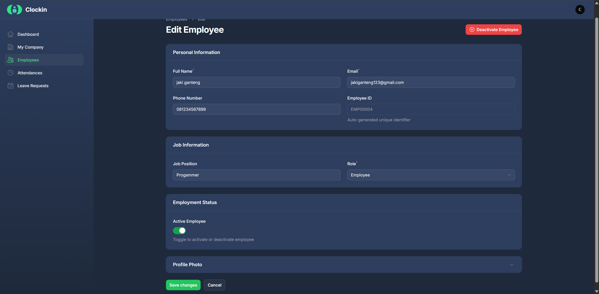

### 📝 Deskripsi
**Modul untuk mengelola data master karyawan**

**Fungsi:**
- Menambah karyawan baru ke sistem
- Melihat daftar semua karyawan
- Edit data karyawan
- View detail profile karyawan
- Filter dan search karyawan

**Cara Pakai:**

### 📋 Melihat Daftar Karyawan:
1. Dari menu sidebar, klik **"Employees"**
2. Akan muncul tabel daftar karyawan dengan kolom:
   - **Name:** Nama lengkap karyawan
   - **Email:** Email untuk login
   - **Phone:** Nomor telepon
   - **Company:** Nama perusahaan
   - **Actions:** Tombol View/Edit/Delete
3. Gunakan **search bar** untuk cari karyawan
4. Gunakan **filter** untuk filter berdasarkan company/status

### ➕ Tambah Karyawan Baru:
1. Klik tombol **"Create"** atau **"New Employee"** di pojok kanan atas
2. Isi form data karyawan:
   
   **Personal Information:**
   - **Full Name** (required)
   - **Email** (required, unique)
   - **Phone Number**
   - **Password** (required untuk akun baru)
   - **Password Confirmation**
   
   **Company Information:**
   - **Company** (pilih dari dropdown)
   - **Photo** (upload foto profile, optional)

3. Klik **"Create"** untuk menyimpan
4. Karyawan baru berhasil ditambahkan
5. Karyawan bisa login ke mobile app dengan email dan password yang dibuat

### 👁️ View Detail Karyawan:
1. Dari list karyawan, klik **icon mata (view)** di kolom Actions
2. Akan muncul halaman detail dengan informasi:
   - Foto profile karyawan
   - Personal information (nama, email, phone)
   - Company information
   - Created date & Last updated
3. Klik tombol **"Edit"** untuk ubah data

### ✏️ Edit Data Karyawan:
1. Klik **icon pensil (edit)** di kolom Actions, atau
2. Dari halaman detail, klik tombol **"Edit"**
3. Edit data yang perlu diubah di form
4. Klik **"Save changes"** untuk update

### 🗑️ Hapus Karyawan:
1. Klik **icon trash (delete)** di kolom Actions
2. Muncul konfirmasi: "Are you sure?"
3. Klik **"Confirm"** untuk hapus permanent
4. ⚠️ **Hati-hati:** Data yang dihapus tidak bisa dikembalikan

**Data yang Dikelola:**
- 👤 **Personal Data:** Nama, Email, Phone
- 🏢 **Company:** Perusahaan tempat karyawan bekerja
- 📷 **Photo:** Foto profile karyawan
- 🔑 **Password:** Untuk login mobile app
- 📅 **Timestamp:** Created at & Updated at

**Fitur Tabel:**
- 🔍 **Search:** Cari berdasarkan nama, email, atau phone
- 🔽 **Filter:** Filter berdasarkan company
- 📄 **Pagination:** Navigate halaman jika data banyak
- 🔢 **Per Page:** Ubah jumlah data per halaman (10, 25, 50)

**Tips:**
- Pastikan email unique (tidak ada duplikat) saat tambah karyawan
- Upload foto profile dengan ukuran maksimal 2MB
- Gunakan password yang kuat untuk keamanan
- Backup data karyawan secara berkala
- Jangan hapus karyawan jika masih ada data attendance-nya

---

## 5. Data Kehadiran (Attendances)

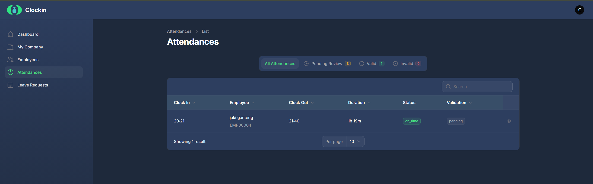
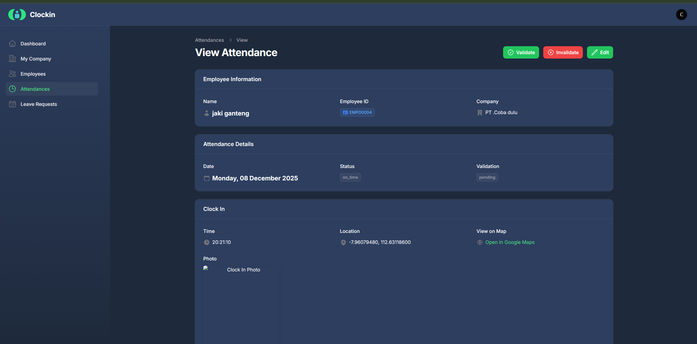
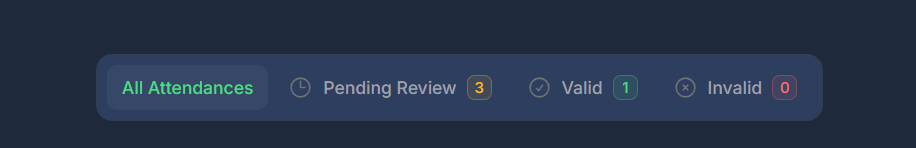

### 📝 Deskripsi
**Modul untuk melihat dan mengelola data kehadiran karyawan**

**Fungsi:**
- Melihat semua record kehadiran karyawan
- View detail check in/out dengan lokasi dan foto
- Filter kehadiran berdasarkan tanggal, karyawan, atau company
- Export data kehadiran
- Monitoring kehadiran harian, mingguan, bulanan

**Cara Pakai:**

### 📋 Melihat Daftar Kehadiran:
1. Dari menu sidebar, klik **"Attendances"**
2. Akan muncul tabel data kehadiran dengan kolom:
   - **Employee:** Nama karyawan
   - **Company:** Nama perusahaan
   - **Date:** Tanggal kehadiran
   - **Check In Time:** Jam check in
   - **Check Out Time:** Jam check out (jika sudah check out)
   - **Check In Photo:** Thumbnail foto saat check in
   - **Check Out Photo:** Thumbnail foto saat check out
   - **Check In Location:** Koordinat GPS check in
   - **Check Out Location:** Koordinat GPS check out
   - **Status:** On Time / Late / Early Leave
   - **Actions:** Tombol View detail

### 👁️ View Detail Kehadiran:
1. Klik **icon mata (view)** di kolom Actions
2. Akan muncul detail lengkap:
   
   **Employee Information:**
   - Nama karyawan
   - Company
   - Tanggal kehadiran
   
   **Check In Details:**
   - Waktu check in
   - Foto selfie check in (full size, bisa di-zoom)
   - Lokasi GPS (latitude, longitude)
   - Map view lokasi check in
   
   **Check Out Details:** (jika sudah check out)
   - Waktu check out
   - Foto selfie check out (full size)
   - Lokasi GPS check out
   - Map view lokasi check out
   
   **Status & Notes:**
   - Status kehadiran (On Time / Late / Early Leave)
   - Work duration (total jam kerja)
   - Notes (jika ada)

3. Klik tombol **"Back"** untuk kembali ke list

### 🔍 Filter & Search Kehadiran:
1. Gunakan **search bar** untuk cari berdasarkan nama karyawan
2. Gunakan **filter** untuk:
   - **Date Range:** Pilih tanggal mulai - selesai
   - **Company:** Filter berdasarkan perusahaan
   - **Employee:** Filter karyawan tertentu
   - **Status:** Filter by status (On Time / Late / All)
3. Klik **"Apply Filter"** untuk menampilkan hasil filter
4. Klik **"Reset"** untuk clear semua filter

### 📊 Informasi yang Ditampilkan:
- ⏰ **Waktu Check In/Out:** Jam masuk dan pulang karyawan
- 📍 **Lokasi GPS:** Koordinat lokasi saat check in/out
- 📷 **Foto Selfie:** Verifikasi karyawan dengan foto
- 🗺️ **Map View:** Visualisasi lokasi di peta (Google Maps)
- ⏱️ **Work Duration:** Total jam kerja
- ✅ **Status:** On Time, Late, Early Leave

**Fitur Tabel:**
- 🔍 **Search:** Cari berdasarkan nama karyawan
- 🔽 **Filter:** Filter by date, company, employee, status
- 📄 **Pagination:** Navigate halaman
- 🔢 **Per Page:** Ubah jumlah record per halaman
- 📥 **Export:** Export data ke Excel/PDF

**Status Kehadiran:**
- 🟢 **On Time:** Check in tepat waktu
- 🟡 **Late:** Check in terlambat
- 🟠 **Early Leave:** Check out lebih awal dari jadwal
- 🔵 **Normal:** Check in & check out sesuai jadwal

**Tips:**
- Gunakan filter date range untuk laporan periode tertentu
- Klik foto untuk lihat full size dan verify karyawan
- Cek map view untuk memastikan karyawan check in dari lokasi yang benar
- Export data untuk report bulanan ke HRD atau management
- Monitor daily attendance untuk tracking kehadiran real-time

---

## 6. Pengajuan Izin & Cuti (Leave Requests)

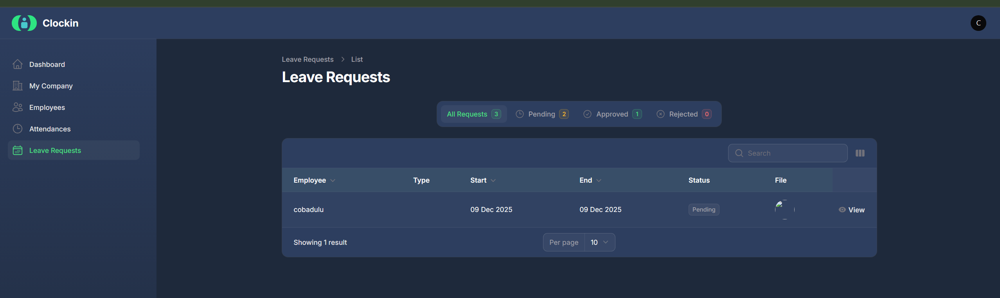

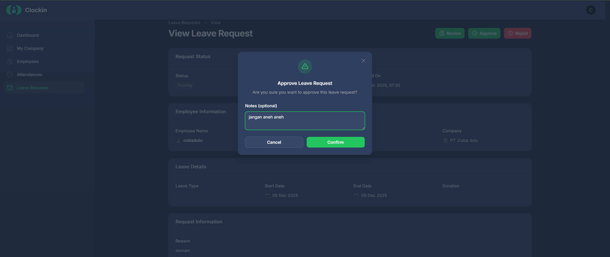

### 📝 Deskripsi
**Modul untuk mengelola pengajuan izin dan cuti karyawan**

**Fungsi:**
- Melihat semua pengajuan izin/cuti dari karyawan
- View detail pengajuan (tanggal, alasan, dokumen)
- Approve atau reject pengajuan
- Create pengajuan atas nama karyawan (jika diperlukan)
- Filter berdasarkan status (Pending/Approved/Rejected)

**Cara Pakai:**

### 📋 Melihat Daftar Leave Requests:
1. Dari menu sidebar, klik **"Leave Requests"**
2. Akan muncul tabel pengajuan dengan kolom:
   - **Employee:** Nama karyawan yang mengajukan
   - **Company:** Nama perusahaan
   - **Leave Type:** Jenis izin (Sick Leave / Annual Leave / Permission)
   - **Start Date:** Tanggal mulai izin
   - **End Date:** Tanggal selesai izin
   - **Reason:** Alasan izin
   - **Status:** Pending / Approved / Rejected
   - **Actions:** View / Edit / Delete

### 👁️ View Detail Leave Request:
1. Klik **icon mata (view)** di kolom Actions
2. Akan muncul detail lengkap:
   
   **Employee Information:**
   - Nama karyawan
   - Company
   
   **Leave Details:**
   - **Leave Type:** Sick Leave / Annual Leave / Permission
   - **Start Date:** Tanggal mulai
   - **End Date:** Tanggal selesai
   - **Total Days:** Total hari izin
   - **Reason:** Alasan/keterangan izin
   - **Document:** File pendukung (surat dokter, dll) - bisa download
   
   **Status & Approval:**
   - **Status:** Pending / Approved / Rejected
   - **Submitted At:** Tanggal pengajuan
   - **Approved/Rejected At:** Tanggal approval (jika sudah)
   - **Approved/Rejected By:** Nama admin yang approve/reject

3. Dari halaman detail, admin bisa:
   - Klik **"Approve"** untuk menyetujui
   - Klik **"Reject"** untuk menolak
   - Klik **"Edit"** untuk ubah data

### ✅ Approve Leave Request:
1. Dari halaman detail, klik tombol **"Approve"**
2. Muncul konfirmasi: "Are you sure want to approve this leave request?"
3. Klik **"Confirm"**
4. Status berubah menjadi **"Approved"**
5. Notifikasi otomatis dikirim ke karyawan (via mobile app)

### ❌ Reject Leave Request:
1. Dari halaman detail, klik tombol **"Reject"**
2. Muncul form **rejection reason** (optional tapi recommended)
3. Isi alasan penolakan
4. Klik **"Confirm Reject"**
5. Status berubah menjadi **"Rejected"**
6. Notifikasi + alasan dikirim ke karyawan

### ➕ Create Leave Request (Admin):
1. Klik tombol **"Create"** atau **"New Leave Request"**
2. Isi form:
   - **Employee:** Pilih karyawan dari dropdown
   - **Leave Type:** Sick Leave / Annual Leave / Permission
   - **Start Date:** Tanggal mulai
   - **End Date:** Tanggal selesai
   - **Reason:** Alasan izin
   - **Document:** Upload file pendukung (optional)
   - **Status:** Pending / Approved (default: Pending)
3. Klik **"Create"** untuk menyimpan
4. Leave request berhasil dibuat

### ✏️ Edit Leave Request:
1. Klik **icon edit** di kolom Actions
2. Edit data yang perlu diubah
3. Klik **"Save changes"**
4. Leave request berhasil diupdate

### 🗑️ Delete Leave Request:
1. Klik **icon delete** di kolom Actions
2. Muncul konfirmasi
3. Klik **"Confirm"** untuk hapus

### 🔍 Filter & Search:
- **Search Bar:** Cari berdasarkan nama karyawan
- **Filter by Status:** Pending / Approved / Rejected / All
- **Filter by Leave Type:** Sick / Annual / Permission
- **Filter by Date Range:** Pilih range tanggal
- **Filter by Company:** Pilih company tertentu

**Leave Type (Jenis Izin):**
- 🤒 **Sick Leave:** Izin sakit (biasanya perlu surat dokter)
- 🏖️ **Annual Leave:** Cuti tahunan
- 📝 **Permission:** Izin (keperluan pribadi, dll)

**Status Pengajuan:**
- 🟡 **Pending:** Menunggu approval admin
- 🟢 **Approved:** Disetujui
- 🔴 **Rejected:** Ditolak

**Fitur Tabel:**
- 🔍 **Search:** Cari karyawan
- 🔽 **Filter:** Filter by status, type, date, company
- 📄 **Pagination:** Navigate halaman
- 🔢 **Per Page:** Ubah jumlah record per halaman
- 📥 **Export:** Export data leave requests

**Tips:**
- Prioritaskan review untuk pengajuan dengan status **Pending**
- Verifikasi dokumen pendukung (surat dokter) untuk Sick Leave
- Berikan alasan yang jelas jika reject pengajuan
- Monitor leave requests secara berkala agar tidak menumpuk
- Export data untuk laporan cuti bulanan/tahunan

---

## 7. Pengaturan Perusahaan (My Company)

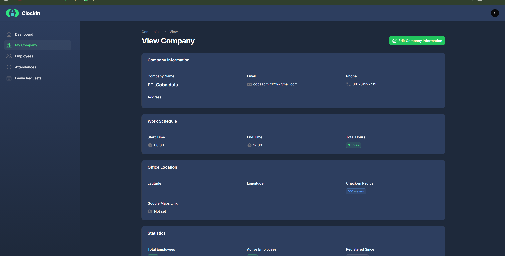
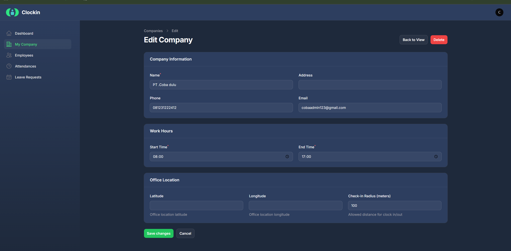

### 📝 Deskripsi
**Modul untuk mengelola data perusahaan/company**

**Fungsi:**
- Melihat data company
- Edit informasi company (nama, email, phone, address)
- Set work schedule (jam kerja, total hours)
- Set office location (latitude, longitude, check-in radius)
- Manage multiple companies (jika sistem multi-company)

**Cara Pakai:**

### 📋 Melihat Data Company:
1. Dari menu sidebar, klik **"My Company"**
2. Akan muncul halaman view company dengan 3 section:

   **Section 1: Company Information**
   - **Company Name:** Nama perusahaan (contoh: PT Coba dulu)
   - **Email:** Email perusahaan (contoh: cobaadmin123@gmail.com)
   - **Phone:** Nomor telepon (contoh: 081681222412)
   - **Address:** Alamat kantor

   **Section 2: Work Schedule**
   - **Start Time:** Jam mulai kerja (contoh: 08:00)
   - **End Time:** Jam selesai kerja (contoh: 17:00)
   - **Total Hours:** Total jam kerja per hari (contoh: 9 hours)

   **Section 3: Office Location**
   - **Latitude:** Koordinat latitude kantor
   - **Longitude:** Koordinat longitude kantor
   - **Check-In Radius:** Radius area check in (contoh: 100 meters)

### ✏️ Edit Company Information:
1. Dari halaman view company, klik tombol **"Edit Company Information"** (hijau, pojok kanan atas)
2. Akan muncul form edit dengan semua field:
   
   **Company Information:**
   - **Company Name** (required)
   - **Email** (required, format email)
   - **Phone** (required)
   - **Address** (textarea)
   
   **Work Schedule:**
   - **Start Time** (time picker, contoh: 08:00)
   - **End Time** (time picker, contoh: 17:00)
   - Total Hours akan otomatis calculated
   
   **Office Location:**
   - **Latitude** (decimal, contoh: -6.200000)
   - **Longitude** (decimal, contoh: 106.816666)
   - **Check-In Radius** (dalam meter, contoh: 100)

3. Edit data yang perlu diubah
4. Klik **"Save changes"** untuk update
5. Company information berhasil diupdate

### 📍 Set Office Location:
**Cara 1: Input Manual Koordinat**
1. Cari koordinat kantor di Google Maps
2. Copy latitude dan longitude
3. Paste ke field Latitude & Longitude
4. Set check-in radius (recommended: 50-200 meter)
5. Save

**Cara 2: Gunakan Map Picker** (jika ada fitur map)
1. Klik pada peta untuk set lokasi
2. Pin akan muncul di lokasi yang dipilih
3. Adjust radius dengan slider
4. Save

### ⏰ Set Work Schedule:
1. Set **Start Time:** Jam masuk kerja (default: 08:00)
2. Set **End Time:** Jam pulang kerja (default: 17:00)
3. **Total Hours** akan otomatis calculated
4. Contoh: 08:00 - 17:00 = 9 hours (dengan asumsi 1 jam break)
5. Save changes

**Parameter yang Dikelola:**

### 🏢 Company Information:
- **Company Name:** Nama perusahaan/organisasi
- **Email:** Email official perusahaan
- **Phone:** Nomor telepon perusahaan
- **Address:** Alamat lengkap kantor

### ⏰ Work Schedule:
- **Start Time:** Jam mulai kerja (Check In)
- **End Time:** Jam selesai kerja (Check Out)
- **Total Hours:** Total jam kerja per hari

### 📍 Office Location:
- **Latitude:** Koordinat latitude (-90 to 90)
- **Longitude:** Koordinat longitude (-180 to 180)
- **Check-In Radius:** Jarak maksimal check in dari titik office (dalam meter)

**Radius Check-In:**
- Karyawan hanya bisa check in jika berada dalam radius yang ditentukan
- Recommended: 50-200 meter tergantung luas area kantor
- Contoh: Radius 100m = karyawan bisa check in dalam 100 meter dari titik kantor

**Tips:**
- Gunakan Google Maps untuk dapatkan koordinat yang akurat
- Set radius tidak terlalu kecil (minimal 50m) untuk toleransi akurasi GPS
- Jika kantor besar/multi-building, set radius 150-200m
- Update work schedule jika ada perubahan jam kerja
- Pastikan data company selalu up-to-date untuk referensi karyawan

**Multiple Companies:**
- Jika sistem support multi-company, akan ada list companies
- Setiap company punya setting work schedule dan location sendiri
- Karyawan di-assign ke company tertentu
- Admin bisa manage multiple companies dari satu dashboard

---

## 8. Logout

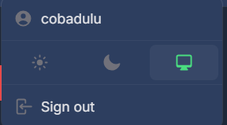

### 📝 Deskripsi
**Fitur untuk keluar dari sistem dan mengakhiri session admin**

**Fungsi:**
- Mengakhiri session login
- Security untuk mencegah unauthorized access
- Clear cache lokal

**Cara Pakai:**
1. Klik **avatar/profile icon** atau nama user di pojok kanan atas
2. Akan muncul dropdown menu dengan opsi:
   - **Profile:** Lihat/edit profile admin
   - **Settings:** Pengaturan akun
   - **Logout:** Keluar dari sistem
3. Klik **"Logout"**
4. Muncul konfirmasi (optional): "Yakin ingin keluar?"
5. Klik **"Ya"** atau **"Confirm"**
6. Session berakhir, redirect ke halaman login
7. Admin harus login ulang untuk akses sistem

**Kapan Perlu Logout:**
- ✅ Selesai menggunakan sistem
- ✅ Mau ganti user/admin lain
- ✅ Tinggalkan komputer di tempat publik
- ✅ Akhir hari kerja
- ✅ Sebelum menutup browser

**Best Practice:**
- ✅ Selalu logout setelah selesai bekerja
- ✅ Jangan tinggalkan browser login tanpa logout
- ✅ Clear browser cache jika menggunakan komputer publik
- ✅ Logout otomatis setelah idle (biasanya 30-60 menit)

**Security Tips:**
- Jangan share session dengan orang lain
- Logout jika meninggalkan komputer
- Jangan save password di browser publik
- Admin activity akan tercatat di audit log

---

---

## 📞 Support & Bantuan

Jika mengalami kendala atau butuh bantuan:
- 📧 Email: admin-support@clockin.cloud
- 💬 WhatsApp: +62 xxx-xxxx-xxxx
- 🌐 Website: https://clockin.cloud
- 📚 Documentation: https://clockin.cloud/docs

**Tim Support:**
- **Technical Support:** Senin-Jumat, 08:00-17:00
- **Emergency Hotline:** 24/7 untuk critical issues

---

## ⚠️ Best Practice & Security

### ✅ Do's:
- Logout setelah selesai menggunakan sistem
- Gunakan password yang kuat dan unique
- Enable two-factor authentication
- Review audit log secara berkala
- Backup data secara rutin
- Update sistem saat ada patch security

### ❌ Don'ts:
- Jangan share kredensial login admin
- Jangan approve izin tanpa verifikasi dokumen
- Jangan export data sensitive ke personal email
- Jangan disable security features
- Jangan edit data tanpa alasan yang jelas

---

## 🔐 Compliance & Privacy

ClockIn+ comply dengan:
- ✅ **GDPR:** Data privacy protection
- ✅ **ISO 27001:** Information security management
- ✅ **UU ITE Indonesia:** Compliance dengan regulasi lokal

**Data Protection:**
- Semua data karyawan di-encrypt
- Foto selfie disimpan secure dengan access control
- Lokasi GPS hanya digunakan untuk validasi kehadiran
- Data tidak dibagikan ke third party

---

**© 2025 ClockIn+ by Team Kelompok 4 Sehat 5 Sempurna**  
*Ngoding sehat, hasil sempurna... kadang-kadang.* 😄

---

## 📋 Checklist Screenshot Web Admin

Berikut adalah checklist screenshot yang perlu diambil untuk melengkapi manual ini:

### ✅ Halaman Umum & Authentication
- [ ] ~~`landing.png` - Landing page web~~ ✅ Sudah ada
- [ ] ~~`landing2.png` - Landing page section 2~~ ✅ Sudah ada
- [ ] ~~`landing3.png` - Landing page section 3~~ ✅ Sudah ada
- [ ] ~~`login.png` - Halaman login~~ ✅ Sudah ada
- [ ] ~~`dashboard.png` - Dashboard utama~~ ✅ Sudah ada

### 📋 Employees (Manajemen Karyawan)
- [ ] `employees-list.png` - Halaman list karyawan dengan tabel
- [ ] `employees-create.png` - Form tambah karyawan baru
- [ ] `employees-detail.png` - Halaman view detail karyawan
- [ ] `employees-edit.png` - Form edit data karyawan

### ⏰ Attendances (Data Kehadiran)
- [ ] `attendances-list.png` - Halaman list data kehadiran
- [ ] `attendances-detail.png` - Halaman detail satu record attendance
- [ ] `attendances-filter.png` - Tampilan dengan filter aktif

### 📝 Leave Requests (Pengajuan Izin & Cuti)
- [ ] `leave-requests-list.png` - Halaman list pengajuan
- [ ] `leave-requests-detail.png` - Detail satu pengajuan
- [ ] `leave-requests-create.png` - Form create leave request (jika ada)
- [ ] `leave-requests-edit.png` - Form edit pengajuan

### 🏢 My Company (Pengaturan Perusahaan)
- [ ] `company-list.png` - List companies (jika multi-company)
- [ ] `company-view.png` - View detail company (sudah ada sebagai dashboard.JPG)
- [ ] `company-edit.png` - Form edit company information

### 🚪 Logout
- [ ] `logout-menu.png` - Dropdown menu dengan opsi logout

**Cara Mengambil Screenshot:**
1. Login ke web admin di browser
2. Navigate ke halaman yang akan di-screenshot
3. Gunakan Snipping Tool (Windows) atau Screenshot tool lainnya
4. Ambil screenshot full page atau specific section
5. Save dengan nama file sesuai checklist di atas
6. Simpan di folder: `docs/screenshots/web/`
7. Pastikan resolusi cukup clear (minimal 1366x768)

**Tips Screenshot:**
- Gunakan data dummy yang realistis
- Pastikan tidak ada data sensitive/real di screenshot
- Ambil screenshot dalam mode light/dark (sesuai design)
- Crop jika perlu untuk fokus ke bagian penting
- Hindari screenshot dengan error/loading state

---

## 📋 Checklist Onboarding Admin Baru

Untuk admin baru, pastikan sudah melakukan hal berikut:

- [ ] Akses login web admin berhasil
- [ ] Ganti password default ke password yang kuat
- [ ] Enable two-factor authentication
- [ ] Review dashboard dan menu-menu yang tersedia
- [ ] Test tambah karyawan baru
- [ ] Test approval izin/cuti
- [ ] Test generate report dan export
- [ ] Set lokasi kantor dan radius
- [ ] Configure jadwal kerja
- [ ] Setup notification email
- [ ] Test monitoring real-time
- [ ] Baca dokumentasi lengkap
- [ ] Hubungi Super Admin jika ada pertanyaan

**Selamat menggunakan ClockIn+ Web Admin!** 🎉
